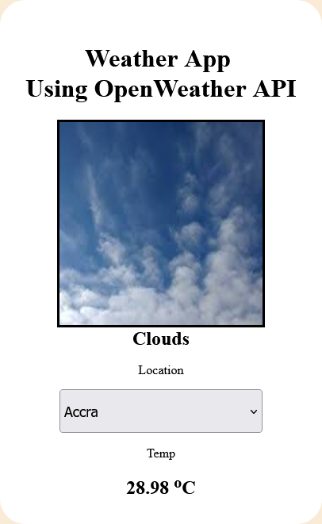

# Weather App Using OpenWeather API

This is a simple Weather App I did during my early days of learning HTML,CSS.

## Preview of Website

You can check it out by clicking the link here:

## GitHub Pages

[https://kofi100.github.io/weather-App-HTML/](https://kofi100.github.io/weather-App-HTML/)
